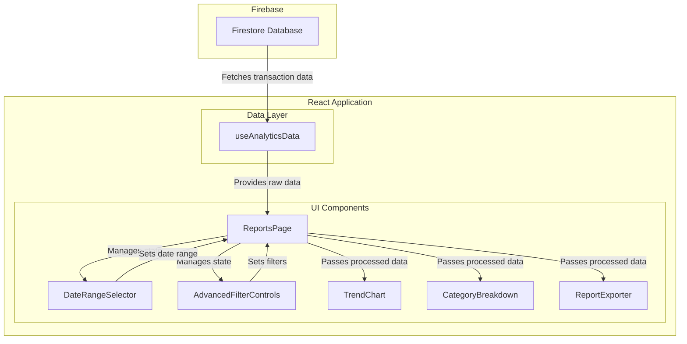

# Advanced Reporting & Analytics Dashboard: Technical Architecture

## 1. Overview

This document outlines the technical architecture for the new "Advanced Reporting & Analytics Dashboard." The goal is to create a flexible and performant analytics experience for users, enabling them to gain deeper insights into their financial habits.

This architecture is designed to integrate seamlessly with the existing React application, leveraging the current technology stack (React, TypeScript, Chart.js, Firestore) while introducing new components and data strategies to support advanced reporting features.

## 2. Core Requirements

The new dashboard will be accessible via a "Reports" tab and will include:
- Spending trends over time (monthly line charts).
- Category-specific spending analysis.
- Income vs. Expense comparisons.
- Custom date range filtering.
- Month-over-month and year-over-year analysis.
- Advanced filtering and search.
- CSV data export functionality.

---

*Further sections will be detailed below.*

## 3. Component Breakdown

A modular, hierarchical component structure will be adopted. All new components will reside in `src/features/reports/`.

- **`ReportsPage.tsx`**: The main container for the analytics dashboard.
    - **Responsibility**: Manages the overall layout, including the new "Reports" tab integration into the main `Dashboard.tsx`. It will house all other reporting components and manage the global state for the reports page, such as the selected date range and active filters.

- **`DateRangeSelector.tsx`**: A reusable component for selecting date ranges.
    - **Responsibility**: Provides UI for selecting predefined ranges (e.g., last 6 months, YTD) and a custom date range picker. It will lift its state up to `ReportsPage.tsx`.

- **`TrendChart.tsx`**: A versatile chart component for displaying time-series data.
    - **Responsibility**: Renders line or bar charts for spending trends, income vs. expense analysis, and category-specific trends. It will receive its data and configuration as props from `ReportsPage.tsx`.

- **`CategoryBreakdown.tsx`**: A component to visualize spending by category.
    - **Responsibility**: Displays a doughnut or pie chart showing the proportion of spending across different categories for the selected period. It will also include a data table view of the same information.

- **`ComparisonView.tsx`**: A component for comparative analysis.
    - **Responsibility**: Displays month-over-month or year-over-year data comparisons. It will likely use a combination of bar charts and summary statistics to highlight changes.

- **`AdvancedFilterControls.tsx`**: A component for advanced data filtering.
    - **Responsibility**: Provides UI elements for filtering the report data, such as text search for transaction descriptions and multi-select for categories.

- **`ReportExporter.tsx`**: A component to handle data exports.
    - **Responsibility**: Contains the logic to convert the current report data into a CSV format and trigger a download for the user.

## 4. Data Fetching & State Management

To support the dynamic nature of the analytics dashboard, we will introduce a new data hook, `useAnalyticsData`, and a well-defined client-side state structure.

### 4.1. New Hook: `useAnalyticsData`

The existing `useData` hook is tailored for a single month's view and fetches all data collections. For the analytics dashboard, we need a more targeted and flexible approach.

**`useAnalyticsData(dateRange: DateRange)`**

- **Purpose**: Fetch transactions (income and expenses) within a specified, flexible date range.
- **Parameters**: It will accept a `dateRange` object (`{ start: Date, end: Date }`).
- **Implementation**:
    - It will create a Firestore query that filters the `income` and `expenses` collections by `userId` and `createdAt` within the given `dateRange`.
    - Unlike `useData`, it will **not** fetch `budgets` or `recurring-transactions` by default, making it more lightweight.
    - The hook will return the raw transaction data, which will then be processed and aggregated on the client-side.

### 4.2. Client-Side State Management

The state will be managed within the `ReportsPage` component and passed down to child components via props.

- **`dateRange`**: `useState<DateRange>`
    - **Managed by**: `DateRangeSelector.tsx` (lifted up).
    - **Description**: Stores the currently selected time frame for all reports.

- **`reportData`**: `useState<AnalyticsData>`
    - **Description**: An object containing the processed data for the charts and tables, derived from the raw data fetched by `useAnalyticsData`. This will be recalculated whenever `dateRange` or filters change.
    - **Shape**:
      ```typescript
      interface AnalyticsData {
        trendData: { month: string; income: number; expenses: number }[];
        categoryBreakdown: { category: string; amount: number }[];
        // ... other processed data structures
      }
      ```

- **`filters`**: `useState<ReportFilters>`
    - **Managed by**: `AdvancedFilterControls.tsx` (lifted up).
    - **Description**: Stores active filters, such as search terms or selected categories.
    - **Shape**:
      ```typescript
      interface ReportFilters {
        searchTerm: string;
        categories: string[];
      }
      ```

## 5. Firestore Data Strategy

Efficient data retrieval is critical for a responsive analytics dashboard. The strategy will focus on efficient queries and minimal data transformation on the client.

### 5.1. Query Strategy

The primary query pattern will involve filtering transactions by a date range.

- **Core Query**: We will use a compound query on the `expenses` and `income` collections:
  ```javascript
  query(collectionRef, 
    where("userId", "==", currentUser.uid),
    where("createdAt", ">=", dateRange.start),
    where("createdAt", "<=", dateRange.end)
  )
  ```
- **Indexing**: To support this query efficiently, a composite index must be created in Firestore for each collection (`expenses` and `income`) on the `userId` and `createdAt` fields. The `firestore.indexes.json` file (or the Firebase console) should be used to define these indexes.

### 5.2. Data Aggregation & Denormalization

For the initial implementation (MVP), all data aggregation (e.g., summing amounts by category or by month) will be performed on the **client-side**. This approach simplifies the backend and is acceptable for users with a moderate amount of data (e.g., up to a few thousand transactions per year).

- **Future-Proofing**: If performance becomes an issue for users with very large datasets, we should consider a more advanced strategy using **Cloud Functions for Firebase**:
    - **Strategy**: Create a new Firestore collection, e.g., `monthlySummaries`.
    - **Trigger**: A Cloud Function would listen for creates, updates, and deletes on the `transactions` collections.
    - **Action**: The function would incrementally update pre-aggregated monthly documents (e.g., `monthlySummary_2023_12`). These documents would store total income, total expenses, and category breakdowns for that month.
    - **Benefit**: The `useAnalyticsData` hook would then query this `monthlySummaries` collection instead, drastically reducing the number of documents read and the amount of client-side computation required. This is a form of **data denormalization** that is well-suited for "read-heavy" analytics workloads.

### 5.3. Firestore Rules

No changes are required to the existing `firestore.rules` for this feature. The current rules, which restrict data access to the authenticated user (`request.auth.uid == resource.data.userId`), are sufficient and secure for the proposed queries.

## 6. Chart.js Integration

Chart.js will be used for all data visualizations. The `TrendChart.tsx` and `CategoryBreakdown.tsx` components will encapsulate the Chart.js logic.

- **Spending Trends Over Time**:
    - **Chart Type**: `Line Chart`
    - **Configuration**:
        - X-axis: Time (e.g., months).
        - Y-axis: Amount in dollars.
        - Datasets: A single dataset for total monthly expenses.
        - Tooltips: Show the exact amount for the hovered-over month.

- **Category-Specific Spending Trends**:
    - **Chart Type**: `Line Chart` (multi-line)
    - **Configuration**:
        - X-axis: Time (e.g., months).
        - Y-axis: Amount in dollars.
        - Datasets: A separate line (dataset) for each of the top 3-5 spending categories, plus an "Other" category.
        - Interaction: Clicking on a category in the legend should toggle its visibility on the chart.

- **Income vs. Expense Trend Analysis**:
    - **Chart Type**: `Bar Chart` (grouped)
    - **Configuration**:
        - X-axis: Time (e.g., months).
        - Y-axis: Amount in dollars.
        - Datasets: Two datasets, one for total income (e.g., green bars) and one for total expenses (e.g., red bars) for each month.

- **Category Spending Breakdown (for a selected period)**:
    - **Chart Type**: `Doughnut Chart`
    - **Configuration**:
        - Segments: Each segment represents a spending category.
        - Segment Value: The total amount spent in that category.
        - Labels: Display the category name and percentage of total spending.
        - This will be similar to the existing `ExpenseChart.tsx` but will operate on the flexible date range.

- **Month-over-Month / Year-over-Year Comparison**:
    - **Chart Type**: `Bar Chart`
    - **Configuration**:
        - X-axis: Categories (e.g., "Income", "Expenses", "Savings").
        - Y-axis: Percentage change.
        - Datasets: One dataset showing the percentage increase or decrease from the previous period.

## 7. Architecture Diagram

The following diagram illustrates the flow of data and the component hierarchy for the analytics dashboard.

