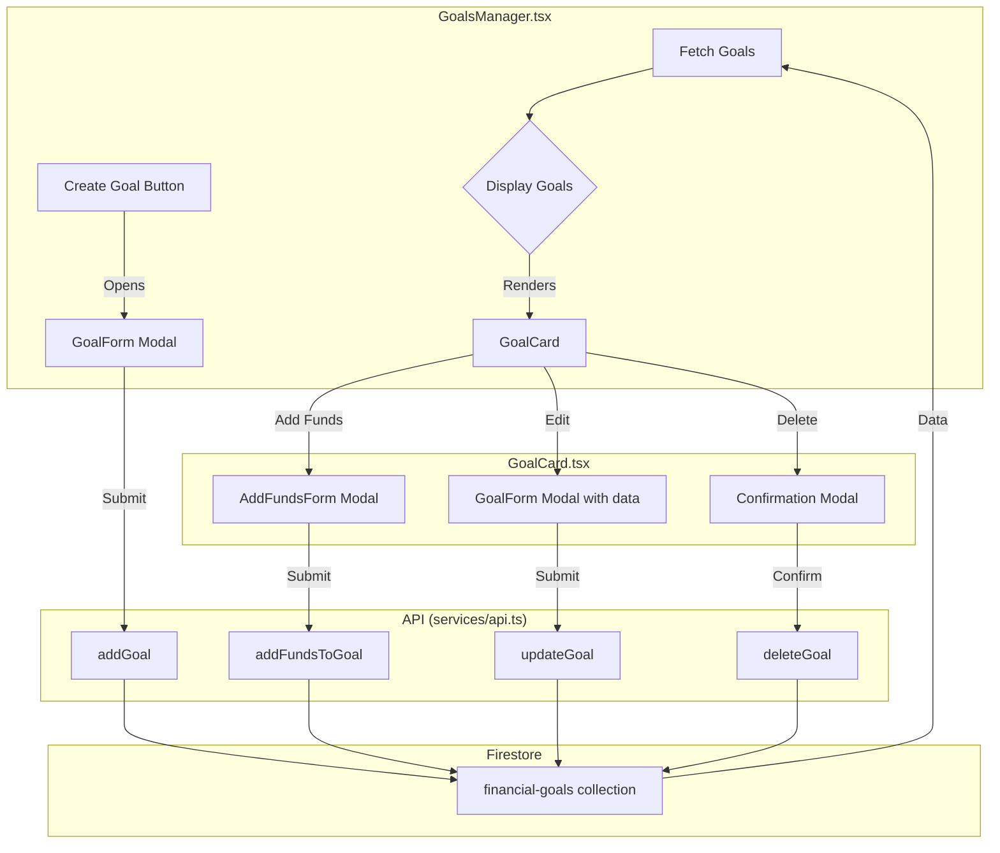

# Goals Manager Architecture

This document outlines the proposed architecture for the improved "Goals Manager" page.

## 1. Component Structure

The new component structure will be as follows:

*   `features/goals/GoalsManager.tsx`: The main container component. It will be responsible for fetching the list of goals and rendering the `GoalCard` components. It will also contain the form for creating a new goal.
*   `features/goals/GoalCard.tsx`: A new component that will display a single goal. It will show the goal's progress, and include buttons for adding funds, editing, and deleting the goal.
*   `features/goals/GoalForm.tsx`: A new component that will contain the form for creating and editing a goal. This will be used in a modal.
*   `features/goals/AddFundsForm.tsx`: A new component that will contain the form for adding funds to a goal. This will be used in a modal.

## 2. Component Props

### `GoalCard.tsx`

| Prop         | Type                      | Description                                  |
| :----------- | :------------------------ | :------------------------------------------- |
| `goal`       | `FinancialGoal`           | The goal object to display.                  |
| `onAddFunds` | `(goalId: string) => void` | A function to call when the user wants to add funds. |
| `onEdit`     | `(goal: FinancialGoal) => void` | A function to call when the user wants to edit the goal. |
| `onDelete`   | `(goalId: string) => void` | A function to call when the user wants to delete the goal. |

### `GoalForm.tsx`

| Prop | Type | Description |
| :--- | :--- | :--- |
| `goal` | `FinancialGoal` (optional) | The goal object to edit. If not provided, the form will be for creating a new goal. |
| `onSubmit` | `(goal: Partial<FinancialGoal>) => void` | A function to call when the form is submitted. |
| `onCancel` | `() => void` | A function to call when the user cancels the form. |

### `AddFundsForm.tsx`

| Prop | Type | Description |
| :--- | :--- | :--- |
| `goal` | `FinancialGoal` | The goal object to add funds to. |
| `onSubmit` | `(amount: number) => void` | A function to call when the form is submitted. |
| `onCancel` | `() => void` | A function to call when the user cancels the form. |

## 3. Data Flow

The data flow for the CRUD operations will be as follows:



## 4. Wireframe

Here is a simple wireframe of the new "Goals Manager" page:

```
+------------------------------------------------------------------+
| Goals Manager                                                    |
+------------------------------------------------------------------+
|                                                                  |
|  +------------------------------------------------------------+  |
|  | Create a new goal                                [Add Goal] |  |
|  +------------------------------------------------------------+  |
|                                                                  |
|  +------------------------------------------------------------+  |
|  | Goal Title 1                                               |  |
|  | ---------------------------------------------------------- |  |
|  | Progress: [|||||||||||||     ] 75%                         |  |
|  | $750 / $1000                                               |  |
|  |                                                            |  |
|  | [Add Funds] [Edit] [Delete]                                |  |
|  +------------------------------------------------------------+  |
|                                                                  |
|  +------------------------------------------------------------+  |
|  | Goal Title 2                                               |  |
|  | ---------------------------------------------------------- |  |
|  | Progress: [|||||               ] 25%                         |  |
|  | $250 / $1000                                               |  |
|  |                                                            |  |
|  | [Add Funds] [Edit] [Delete]                                |  |
|  +------------------------------------------------------------+  |
|                                                                  |
+------------------------------------------------------------------+